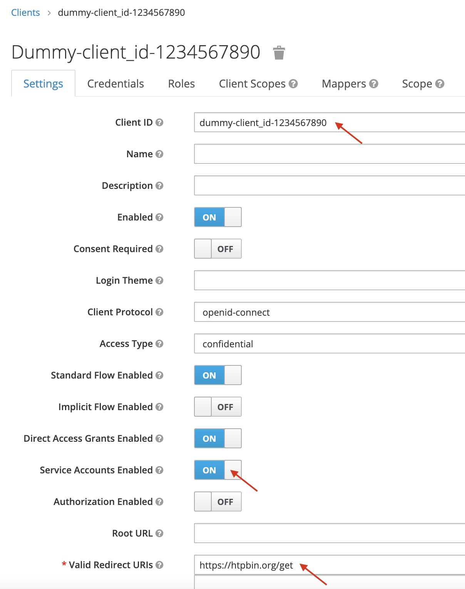
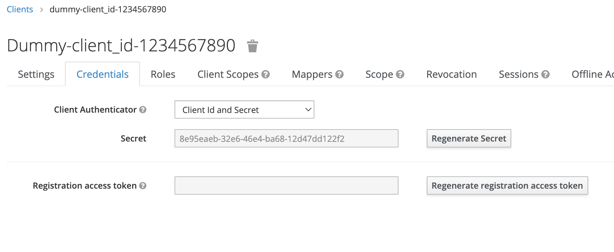
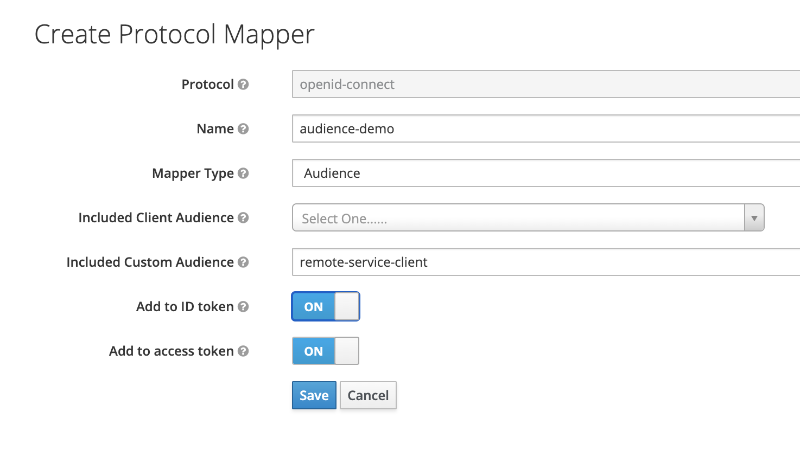

# envoy-adapter-demo

## Notes

cd ../envoy-adapter

---

	export CLI_HOME=$PWD/apigee-remote-service-cli
	export REMOTE_SERVICE_HOME=$PWD/apigee-remote-service-envoy

---

create SA with Apigee Analytics Agent role in GCP

create a key and download the json file

	export AX_SERVICE_ACCOUNT=<your-service-account-with-apigee-ax-agent-role>

---

	export ORG=your-apigeex-org
	export ENV=your-apigeex-env
	export RUNTIME=https://your-apigeex-hostname

## Apigee hybrid only

	export NAMESPACE=apigee 

---

	TOKEN=$(gcloud auth print-access-token);echo $TOKEN

---

cd apigee-remote-service-cli/

---

	./apigee-remote-service-cli provision --organization $ORG \
	--environment $ENV \
     	--runtime $RUNTIME \
	--analytics-sa $AX_SERVICE_ACCOUNT \
	--token $TOKEN > config-jg.yaml

---

mv config-jg.yaml ../../demos/common/

---

cd ../../demos/common/

---

mv config.yaml config.backup

mv config-jg.yaml config.yaml

---

### in the auth section of config.yaml

+ api_key_claim - example:

```
auth:
    api_key_claim: apiKey
```

+ modify the token endpoint for the 'jwt_provider_key' - example:

```
auth:
    api_key_claim: apiKey
    jwt_provider_key: http://34.140.148.116:8080/auth/realms/demo-ea/protocol/openid-connect/token
```

Doc:

https://cloud.google.com/apigee/docs/api-platform/envoy-adapter/v2.0.x/reference#configuration-file

---

Create a GKE cluster:

	gcloud services enable container.googleapis.com
	gcloud container clusters create envoy-gateway-cluster --zone europe-west1-b

---

	alias k=kubectl

	k create namespace apigee

	k apply -f config.yaml

---

	k create configmap standalone-envoy-config --from-file=./standalone-envoy-config.yaml -n apigee

---

	k apply -f standalone-envoy-manifest.yaml -n apigee

---

## Create Client App in Idp

### Clients

Create a new client, set the client Id (name of the client App)

Set properties, as shown on the following picture:



Once the client app has been created you can get the client secret:

 

Copy/paste client_id and client_secret for later use

Set the audience with value remote-service-client:



### Create API Product in Apigee

Name: HTTPBin

Quota: 10 / min

Remote Service:

	httpbin.org

Path:
	/httpbin/*

Method:
	GET
	
## Get a JWT token first, from the IdP (http protocol for test but it MUST be  https):

	curl --location --request POST 'http://<your-idp-hostname>/auth/realms/demo-ea/protocol/openid-connect/token' \
	--header 'Content-Type: application/x-www-form-urlencoded' \
	--data-urlencode 'client_id=<your-client-id>' \
	--data-urlencode 'client_secret=<your-client-secret>' \
	--data-urlencode 'scope=email' \
	--data-urlencode 'grant_type=client_credentials'

## Make a call on the envoy gateway:

	curl -H "Authorization: Bearer ${TOKEN}" http://<envoy-gateway>/httpbin/headers -H "Host: httpbin.org" -v

#### Apigee API

	APIGEE_TOKEN=$(gcloud auth print-access-token);echo $APIGEE_TOKEN

Create a developer:

	curl --fail --silent -X POST \
	-H "Authorization: Bearer $APIGEE_TOKEN" -H "Content-Type:application/json" \
	--data " {\"email\": \"john.doe@example.com\",\"firstName\": \"John\",\"lastName\": \"Doe\",\"userName\": \"jdoe\"}" \
	https://apigee.googleapis.com/v1/organizations/"$APIGEE_X_ORG"/developers

Create an App:

	curl --fail --silent -X POST \
	-H "Authorization: Bearer $APIGEE_TOKEN" -H "Content-Type:application/json" \
	--data " {\"name\": \"httpbin-demo\"}" \
	https://apigee.googleapis.com/v1/organizations/"$APIGEE_X_ORG"/developers/john.doe@example.com/apps

Set client app keys (credentials):

	curl --fail --silent -X POST \
	-H "Authorization: Bearer $APIGEE_TOKEN" -H "Content-Type:application/json" \
	--data "{ \"consumerKey\": \"x-key\", \"consumerSecret\": \"x-secret\" }" \
	https://apigee.googleapis.com/v1/organizations/"$APIGEE_X_ORG"/developers/john.doe@example.com/apps/httpbin-demo/keys/create


